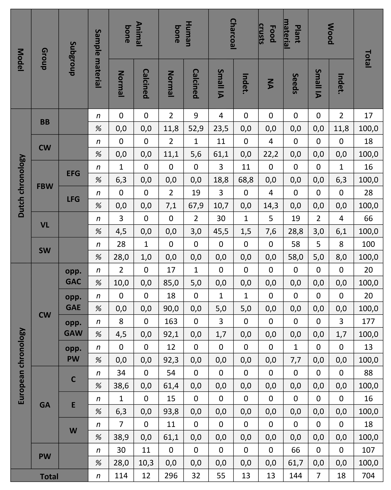

# Bayesian chronological models in Kroon (2026)
This repository contains the raw data, OxCal models, and outputs for 
the Bayesian chronological models in Kroon (in prep.). New Approach 
to Prehistoric Migrations: Bayesian Chronological Modelling and Ceramic 
Technology Shed New Light on the Emergence of Corded Ware. Proceedings 
of the Prehistoric Society.

## Structure of the dataset
The folder structure for the dataset is shown in Suppl. Fig. 1. The 
radiocarbon dates and their sources publications can be found under 
`raw_data`. 

```
// Supplementary Figure 1: Folder structure of the Supplementary data
__OxCal_models
 |___Dutch chronology -> (Kroon in prep., Fig. 2)
 |  |_ bayesian_chronological_model.txt
 |  |_ order.csv
 |  |_ outliers.csv
 |  |_ output.csv
 |  |_ visual_output.pdf
 |___European chronology -> (Kroon in prep., Fig. 8)
 |   |_GAC_CW
 |   |_GAE_CW
 |   |_GAW_CW
 |   |_PW_CW
 |___raw_data
    |_radiocarbon_dates.csv
    |_bibliography_C14s
```

The Bayesian chronological models and their output are ordered by the 
figure in the main text in which they appear. The ordering of the 
files under `Dutch_chronology` (see Suppl. Fig. 1) is identical to that 
of the files in the subfolders of `European_chronology`. For ease of 
computation, the transitions between Pitted Ware (PW), Globular Amphora 
West (GAW), East (GAE), and Central (GAC) on the one hand and local 
Corded Ware (CW) groups have been modelled separately.

The files in the folders contain the following information:
- [name]_bayesian_chronological_models.txt: the model in OxCal CQL as 
  run in OxCal v.4.4.4 (Bronk Ramsey 2021).
- [name]_output.csv: the output of the Bayesian chronological model.
- [name]_order.csv: the raw output of the Order() queries.
- [name]_outliers.csv: the Outlier view of the model output.
- [name]_visual_output.pdf: a visual rendering of the model output. 
  These visualisations show the agreement (Amodel) and comvergence (C) 
  of all models. The brackets and OxCal verbs show the model definition.
  The 2\(\sigma\), and 3\(\sigma\) confidence intervals are shown for 
  all distributions. Solid circles indicate the mean (\(\mu\)) of 
  posterior distributions, transparent circles the means of the 
  radiocarbon dates prior to modelling. All years are modelled years BC.

## Radiocarbon dates
The dataset encompasses 704 radiocarbon dates. These radiocarbon dates 
are reported in `raw_data/radiocarbon_dates.csv` following the 
recommendations by Bayliss (2015). 

The radiocarbon dates used here stem from several overview works. 
Chiefly, Bourgeois _et al._ (2025, S1) for CW and Dutch Bell Beaker 
(BB); Müller (2023, Supplement 9) for GAW, GAC, and GAE; Dreshaj (2022, 
Appendix B; 2023a, 2023b) and Menne and Brunner (2021, Supplement 1) 
for Swifterbant (SW); and lastly Vanhanen _et al._ (2019, Supplementary 
Table 1) and Lindström (2024, Appendix 2) for PW. 

A breakdown of the radiocarbon dates by sample material is shown in 
Suppl. Fig. 1.




Efforts have been made to made to verify each individual radiocarbon 
date with the primary sources, and to gather the relevant contextual 
information (e.g., \(\delta\)13C, \(\delta\)15N). However, these 
efforts were not always succesfull due to the size of the dataset, 
language barriers, and missing information. The current overview is 
therefore best seen as a _status quo_ and (hopefully) as an incentive 
for further improving the quality of the radiocarbon dataset for this 
period (cf. Bayliss 2015), and more in-depth Bayesian chronological 
modelling (e.g, Whittle _et al._ (eds) 2011).

## Model set-up
The aim of these models is to investigate whether the available absolute 
dates support a rapid transition from indigenous societies to Corded 
Ware (CW) during the 3rd millennium BCE in Europe. To this end, the 
models are structured as follows (see Suppl. Fig. 2).

```C++
// Supplementary Figure 2: Example of model structure
 Plot()
 {
  // Outlier models
  Outlier_Model("General", T(5), U(0,4), "t");
  Outlier_Model("Charcoal", Exp(1, -10,0), U(0,3), "t");
  Outlier_Model("Cremation", Exp(0.9,-10,-0.1), U(1,3),"t");
  // Model with independent sequences for CW and PW
  Sequence("CW")
  {
   Boundary("Start_CW")
   {
    Start("Start_CW_S");
    Transition("Start_CW_T");
    End("Start_CW_E");
   };
   Phase("CW radiocarbon dates")
   {
    KDE_Plot("CW")
    {
    };
    Sum()
    {
    };
    //R-dates and appropriate outlier models
    };
   Boundary("End_CW")
   {
    Start("End_CW_S");
    Transition("End_CW_T");
    End("End_CW_E");
   };
  };
  Sequence("FBW")
  {
   Boundary("Start_FBW")
   {
    Start("Start_FBW_S");
    Transition("Start_FBW_T");
    End("Start_FBW_E");
   };
   Phase("FBW radiocarbon dates")
   {
    KDE_Plot("FBW")
    {
    };
    Sum()
    {
    };
    //R-dates and appropriate outlier models
    };
   Boundary("End_FBW")
   {
    Start("End_FBW_S");
    Transition("End_FBW_T");
    End("End_FBW_E");
   };
  };
  Order()
  {
  };
  Difference("Overlap FBW_CW", "Start_CW", "End_FBW");
  Difference("Max overlap FBW_CW", "Start_CW_E", "End_FBW_S");
  Difference("Min overlap FBW_CW", "Start_CW_S", "End_FBW_E");
 };
```
The available radiocarbon dates for CW and the indigenous group in the
respective area (e.g., Funnel Beaker West (FBW) in the Dutch uplands) 
are placed in independent sequences. 

The dates have been calibrated 
with the R-date() function in OxCal and the IntCal20 calibration curve.

The start and end dates of these 
groups are then inferred with a trapezium boundary.

## How to cite
Please cite the main publication: Kroon, E.J., (in prep.). New Approach 
to Prehistoric Migrations: Bayesian Chronological Modelling and Ceramic 
Technology Shed New Light on the Emergence of Corded Ware. Proceedings 
of the Prehistoric Society.

For the radiocarbon dates, please refer to the sources mentioned in 
`raw_data/radiocarbon_dates.csv`.

Bibliography
Bronk Ramsey 2021


[def]: C:\Users\Erik_\Documents\GitHub\overview_table.jpg